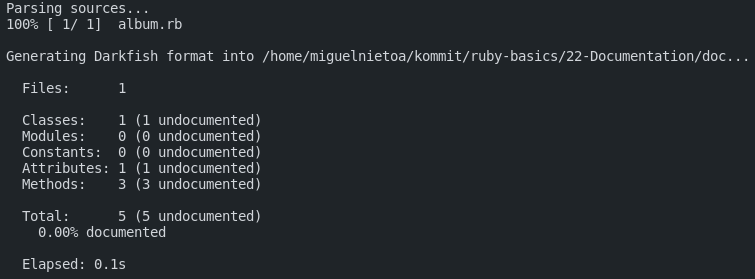
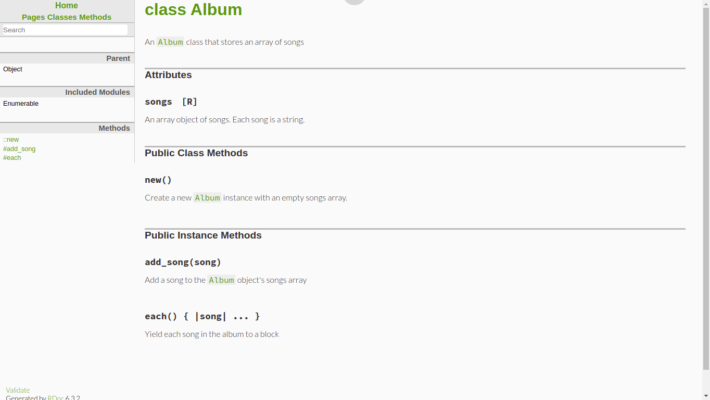

# Ruby Documentation

Helpful links: 
- https://www.rubydoc.info/stdlib

## Generate documentation
```bash
rdoc album.rb
```



`rdoc` should create a new folder called "doc", here you can find a file called `index.html`, open it with a browser and here is the documentation.


